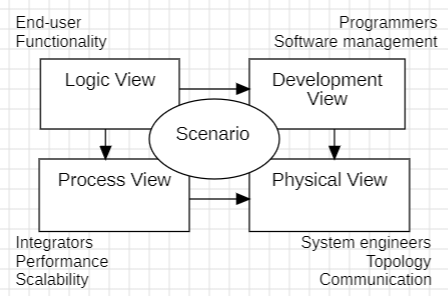
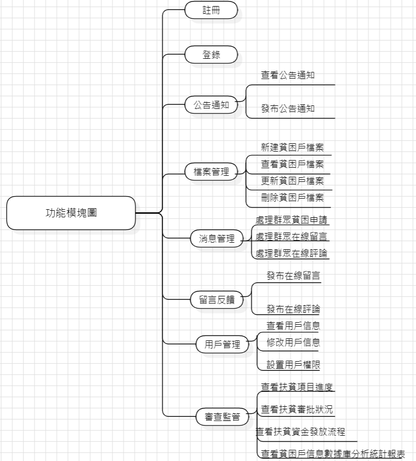
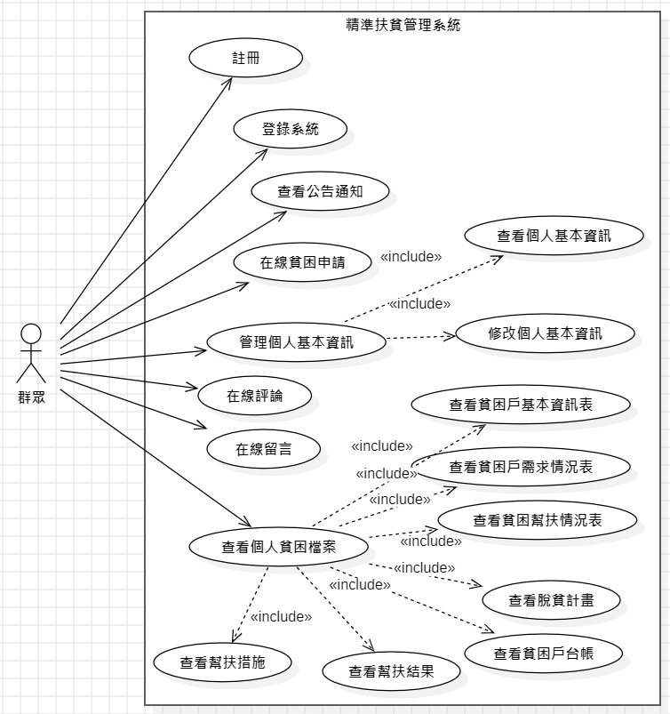
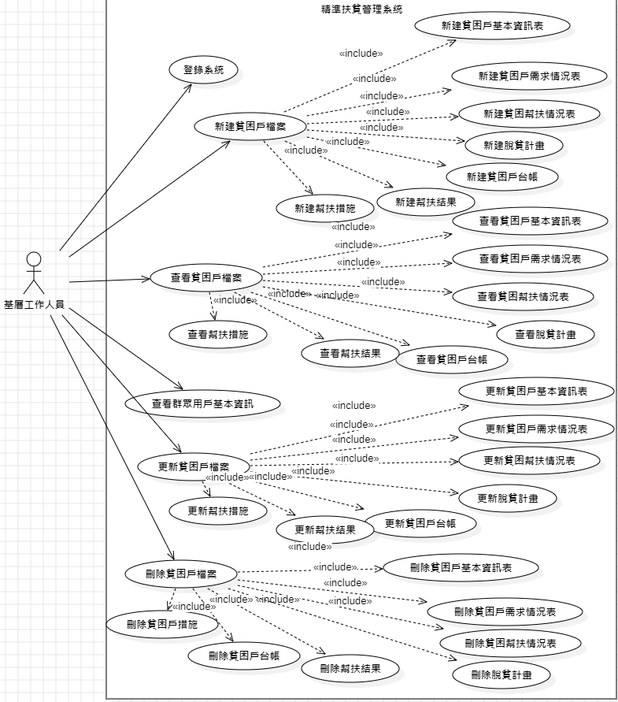
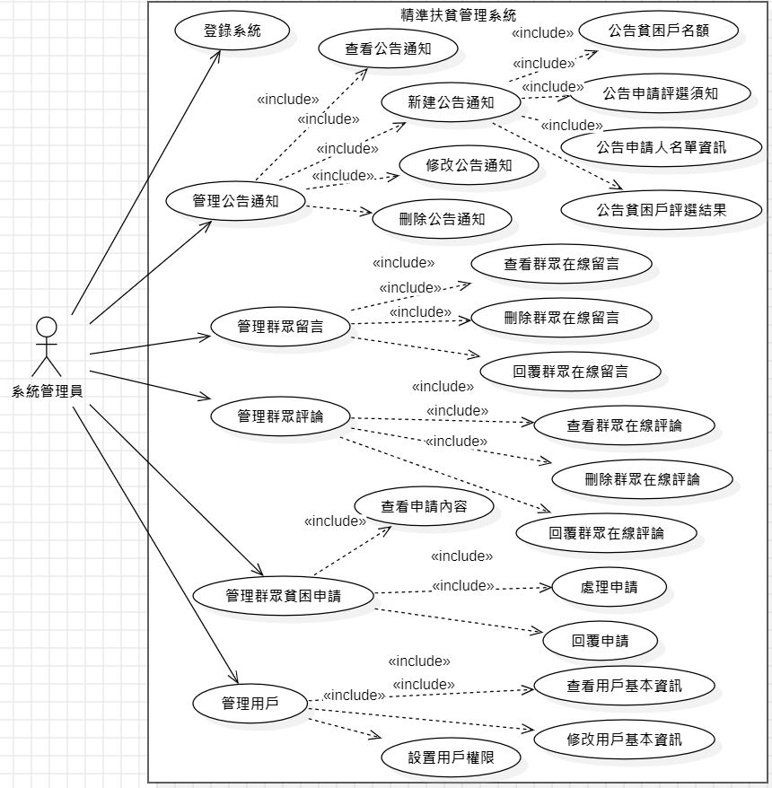
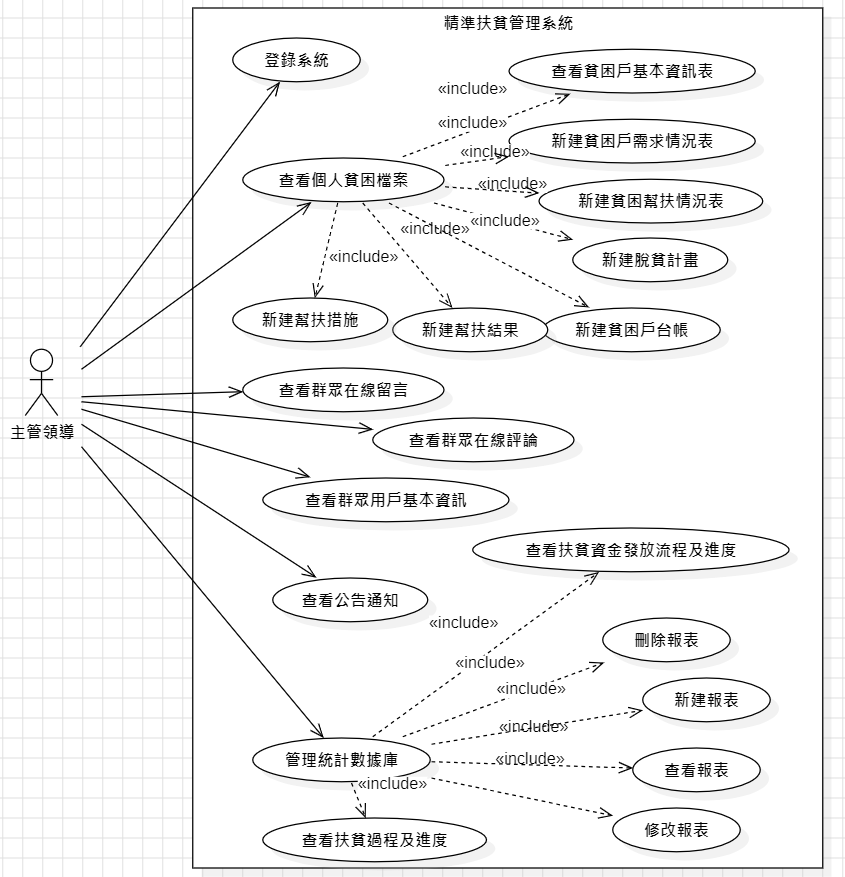

# 南華大學軟體工程-期末報告
# 利用“4+1”視圖建模方法進行“精準扶貧管理系統”的軟件架構設計
## 組員:11024254蔡尚原 11024255蔡尚倫
### 1 “4+1”視圖建模方法
###### 软件架构常用模型就是视图模型，类似于RM-ODP的视点模型，可以从多个角度描述一个复杂的软件系统。最流行的视图模型就是“4+1”视图模型，它由五个视图组成，包括场景视图、逻辑视图、进程视图、物理视图和开发视图，如图1-1所示。我们可以粗略地把“4+1”视图模型看作是参照软件生命周期五个阶段建立的视图模型，虽然实际上每个视图描述的内容并不是局限于生命周期的一个阶段，但显而易见的是，除了结构要素之外，这种视图模型也包含了流程要素。

##### “4+1”視圖模型實際上使得有不同需求的人員能夠得到他們對於軟件體系結構想要了解的東西。系統工程師先從物理視圖，然後從過程視圖靠近體系結構。最終使用者、客戶、數據專家從邏輯視圖看體系結構；項目經理、軟件配置人員從開發視圖看體系結構。
### 2 利用“4+1”視圖建模方法進行“精準扶貧管理系統”的軟件架構設計過程
#### 2.1 精準扶貧管理系統內容描述
###### 精準扶貧信息化平台可實現全省貧困戶信息的全面、準確統計；對扶貧項目、扶貧資金的全面公開、監督管理；對扶貧過程進行有效跟蹤、管理；對扶貧結果進行實時查詢；為扶貧工作的更進一步開展積累有效的基礎數據，為全省扶貧的大數據趨勢分析奠定良好的基礎。精準扶貧信息化平台由精準扶貧管理系統支持，該系統適用於省級、市級扶貧主管部門對扶貧信息數據的及時準確統計，扶貧信息的精準推送，為扶貧工作提供互動溝通的平台，實現對扶貧工作的信息化管理。	
######	精準扶貧管理系統主要分為四個部分，精準識別、精準幫扶／管理、幫扶成效評價意見反饋和大數據分析。整個精準扶貧信息化平台的應用貫穿貧困戶精確識別、精確幫扶、精確管理、幫扶成效評價、意見反饋、大數據分析等整個扶貧全過程；在貧困戶精確識別階段可實現扶貧信息公示、評選結果反饋、建立貧困戶檔案和數據庫等功能；在幫扶階段，可為精確幫扶、精確管理提供信息化手段支撐，包括貧困戶信息管理、陽光操作管理、扶貧事權管理；在幫扶成效評估和意見反饋階段，可提供基於互聯網+的在線評價和網站在線反饋功能；通過對系統運行積累的大數據進行系統分析，可提供對貧困原因、幫扶措施、幫扶效果、貧困戶分布等的關聯性分析，趨勢分析、預測，綜合數據分析，數據挖掘，領導輔助決策，統計報表等功能。具體內容描述如圖2-1-1所示。	
######	具體來講，基於“精準扶貧信息化平台”主要包括全省四級一體的數據平台、基於互聯網的外網網站、各級人員使用的手機APP客戶端、扶貧事權管理系統和扶貧大數據分析系統等主要內容，並建立相應的信息化支撐體系。
#### 2.2 需求分析
##### 2.2.1 角色分類
###### 根據精準扶貧管理系統所有的內容描述，我們可以大致擬定和精準扶貧管理系統有關的角色為以下四種。
| 序號   | 名稱                     | 描述       | 權限       |
|----|--------------------------|------------|--------|
| 1  | 群眾 | 貧困村民     | 1.查看公告通知 2.在線提出貧困申請 3.在線留言評論 4.管理個人基本資料 5.查看個人貧困戶檔案      |
| 2   | 基層工作人員       | 村級幹部或指定的扶貧工作人員，負責群眾檔案管理     | 1.新建貧困戶檔案 2.查詢貧困戶檔案 3.更新貧困戶檔案 4.刪除貧困戶檔案       |
| 3   | 系統管理員        | 指定的系統管理人員，按審核結果進行系統消息管理、發布通知公告和用戶管理     | 1.發布公告通知 2.處理群眾貧困申請 3.留言評論管理 4.用戶管理       |
| 4   | 主管領導          | 鎮級以及以上幹部或指定的扶貧工作人員，負責扶貧審查和監督           | 1.查詢貧困戶檔案 2.查看群眾留言評論 3.查看扶貧資金發放流程 4.查看扶貧過程情況和進度 5.查看貧困戶信息數據庫統計分析報表        |
##### 2.2.2 系統需求分析
###### 精準扶貧信息化平台的應用貫穿貧困戶精確識別、精確幫扶、精確管理、幫扶成效評價、意見反饋、大數據分析等整個扶貧全過程；在貧困戶精確識別階段可實現扶貧信息公示、評選結果反饋、建立貧困戶檔案和數據庫等功能；在幫扶階段，可為精確幫扶、精確管理提供信息化手段支撐，包括貧困戶信息管理、陽光操作管理、扶貧事權管理；在幫扶成效評估和意見反饋階段，可提供基於互聯網+的在線評價和網站在線反饋功能；通過對系統運行積累的大數據進行系統分析，可提供對貧困原因、幫扶措施、幫扶效果、貧困戶分布等的關聯性分析，趨勢分析、預測，綜合數據分析，數據挖掘，領導輔助決策，統計報表等功能。
##### 2.2.3 功能模塊圖
###### 精準扶貧管理系統的功能模塊圖反映了精準扶貧管理系統的功能及各個功能之間的關系。總體分為“註冊”、“登錄”、“公告通知”、“檔案管理”、“消息管理”、“留言反饋”、“用戶管理”、“審查監督”八個模塊，具體內容如圖所示。

#### 2.3場景視圖之用例圖設計建模
##### 2.3.1精準扶貧管理系統用例圖
###### 群眾用例圖、基層工作人員用例圖、系統管理員用例圖以及主管領導用例圖分別如圖所示。

##### 2.3.2 精準扶貧管理系統關鍵用例描述
| 用例編號| 23201|
| 用例名稱| 註冊|
| 主要參與者| 群眾|
| 說明| 群眾註冊精準扶貧管理系統的賬號|
| 前置條件| 無|
| 基本事件流| 1. 點擊註冊按鈕跳轉至註冊頁面 2. 填寫用戶註冊信息 手機 密碼 昵稱 真實姓名 身份證|
| 異常事件流| 1、由於網絡原因，造成數據操作時報錯，關閉報錯信息後停留在原來的界面上。|
| 後置條件| 註冊界面顯示用戶註冊成功|

