# 南華大學軟體工程-期末報告
# 利用“4+1”視圖建模方法進行“精準扶貧管理系統”的軟件架構設計
## 組員:11024254蔡尚原 11024255蔡尚倫
### 1 “4+1”視圖建模方法
###### 软件架构常用模型就是视图模型，类似于RM-ODP的视点模型，可以从多个角度描述一个复杂的软件系统。最流行的视图模型就是“4+1”视图模型，它由五个视图组成，包括场景视图、逻辑视图、进程视图、物理视图和开发视图，如图1-1所示。我们可以粗略地把“4+1”视图模型看作是参照软件生命周期五个阶段建立的视图模型，虽然实际上每个视图描述的内容并不是局限于生命周期的一个阶段，但显而易见的是，除了结构要素之外，这种视图模型也包含了流程要素。

##### “4+1”視圖模型實際上使得有不同需求的人員能夠得到他們對於軟件體系結構想要了解的東西。系統工程師先從物理視圖，然後從過程視圖靠近體系結構。最終使用者、客戶、數據專家從邏輯視圖看體系結構；項目經理、軟件配置人員從開發視圖看體系結構。
### 2 利用“4+1”視圖建模方法進行“精準扶貧管理系統”的軟件架構設計過程
#### 2.1 精準扶貧管理系統內容描述
###### 精準扶貧信息化平台可實現全省貧困戶信息的全面、準確統計；對扶貧項目、扶貧資金的全面公開、監督管理；對扶貧過程進行有效跟蹤、管理；對扶貧結果進行實時查詢；為扶貧工作的更進一步開展積累有效的基礎數據，為全省扶貧的大數據趨勢分析奠定良好的基礎。精準扶貧信息化平台由精準扶貧管理系統支持，該系統適用於省級、市級扶貧主管部門對扶貧信息數據的及時準確統計，扶貧信息的精準推送，為扶貧工作提供互動溝通的平台，實現對扶貧工作的信息化管理。	
######	精準扶貧管理系統主要分為四個部分，精準識別、精準幫扶／管理、幫扶成效評價意見反饋和大數據分析。整個精準扶貧信息化平台的應用貫穿貧困戶精確識別、精確幫扶、精確管理、幫扶成效評價、意見反饋、大數據分析等整個扶貧全過程；在貧困戶精確識別階段可實現扶貧信息公示、評選結果反饋、建立貧困戶檔案和數據庫等功能；在幫扶階段，可為精確幫扶、精確管理提供信息化手段支撐，包括貧困戶信息管理、陽光操作管理、扶貧事權管理；在幫扶成效評估和意見反饋階段，可提供基於互聯網+的在線評價和網站在線反饋功能；通過對系統運行積累的大數據進行系統分析，可提供對貧困原因、幫扶措施、幫扶效果、貧困戶分布等的關聯性分析，趨勢分析、預測，綜合數據分析，數據挖掘，領導輔助決策，統計報表等功能。具體內容描述如圖2-1-1所示。	
######	具體來講，基於“精準扶貧信息化平台”主要包括全省四級一體的數據平台、基於互聯網的外網網站、各級人員使用的手機APP客戶端、扶貧事權管理系統和扶貧大數據分析系統等主要內容，並建立相應的信息化支撐體系。
#### 2.2 需求分析
##### 2.2.1 角色分類
###### 根據精準扶貧管理系統所有的內容描述，我們可以大致擬定和精準扶貧管理系統有關的角色為以下四種。
| 序號   | 名稱                     | 描述       | 權限       |
|----|--------------------------|------------|--------|
| 1  | 群眾 | 貧困村民     | 1.查看公告通知 2.在線提出貧困申請 3.在線留言評論 4.管理個人基本資料 5.查看個人貧困戶檔案      |
| 2   | 基層工作人員       | 村級幹部或指定的扶貧工作人員，負責群眾檔案管理     | 1.新建貧困戶檔案 2.查詢貧困戶檔案 3.更新貧困戶檔案 4.刪除貧困戶檔案       |
| 3   | 系統管理員        | 指定的系統管理人員，按審核結果進行系統消息管理、發布通知公告和用戶管理     | 1.發布公告通知 2.處理群眾貧困申請 3.留言評論管理 4.用戶管理       |
| 4   | 主管領導          | 鎮級以及以上幹部或指定的扶貧工作人員，負責扶貧審查和監督           | 1.查詢貧困戶檔案 2.查看群眾留言評論 3.查看扶貧資金發放流程 4.查看扶貧過程情況和進度 5.查看貧困戶信息數據庫統計分析報表        |
##### 2.2.2 系統需求分析
###### 精準扶貧信息化平台的應用貫穿貧困戶精確識別、精確幫扶、精確管理、幫扶成效評價、意見反饋、大數據分析等整個扶貧全過程；在貧困戶精確識別階段可實現扶貧信息公示、評選結果反饋、建立貧困戶檔案和數據庫等功能；在幫扶階段，可為精確幫扶、精確管理提供信息化手段支撐，包括貧困戶信息管理、陽光操作管理、扶貧事權管理；在幫扶成效評估和意見反饋階段，可提供基於互聯網+的在線評價和網站在線反饋功能；通過對系統運行積累的大數據進行系統分析，可提供對貧困原因、幫扶措施、幫扶效果、貧困戶分布等的關聯性分析，趨勢分析、預測，綜合數據分析，數據挖掘，領導輔助決策，統計報表等功能。
##### 2.2.3 功能模塊圖
###### 精準扶貧管理系統的功能模塊圖反映了精準扶貧管理系統的功能及各個功能之間的關系。總體分為“註冊”、“登錄”、“公告通知”、“檔案管理”、“消息管理”、“留言反饋”、“用戶管理”、“審查監督”八個模塊，具體內容如圖所示。

#### 2.3場景視圖之用例圖設計建模
##### 2.3.1精準扶貧管理系統用例圖
###### 群眾用例圖、基層工作人員用例圖、系統管理員用例圖以及主管領導用例圖分別如圖所示。

##### 2.3.2 精準扶貧管理系統關鍵用例描述
| 用例編號| 23201|
|-----|-----|
| 用例名稱| 註冊|
| 主要參與者| 群眾|
| 說明| 群眾註冊精準扶貧管理系統的賬號|
| 前置條件| 無|
| 基本事件流| 1. 點擊註冊按鈕跳轉至註冊頁面 2. 填寫用戶註冊信息 手機 密碼 昵稱 真實姓名 身份證|
| 異常事件流| 1、由於網絡原因，造成數據操作時報錯，關閉報錯信息後停留在原來的界面上。|
| 後置條件| 註冊界面顯示用戶註冊成功|
#####
| 用例編號| 23202|
|-----|-----|
| 用例名稱| 登錄|
| 主要參與者| 群眾、基層工作人員、系統管理員、主管領導|
| 說明| 用戶在使用精準扶貧管理系統之前，需要進行用戶登錄|
| 前置條件| 註冊用戶或系統分配賬戶|
| 基本事件流| 1. 點擊登錄按鈕跳轉至登錄頁面 2. 填寫用戶登錄信息 手機號 密碼 3. 點擊登錄按鈕|
| 異常事件流| 1. 由於網絡原因，造成數據操作時報錯，關閉報錯信息後停留在原來的界面上。 2. 登錄用戶不存在，提示用戶註冊或輸入正確的用戶名，停留該頁面。 3. 登錄用戶存在，密碼輸入錯誤，提示用戶輸入正確的密碼，停留該頁面。|
| 後置條件| 顯示登錄成功，頁面跳轉到系統首頁|
#### 2.4 邏輯試圖之類圖設計建模
##### 2.4.1 精準扶貧管理系統邏輯視圖-類圖
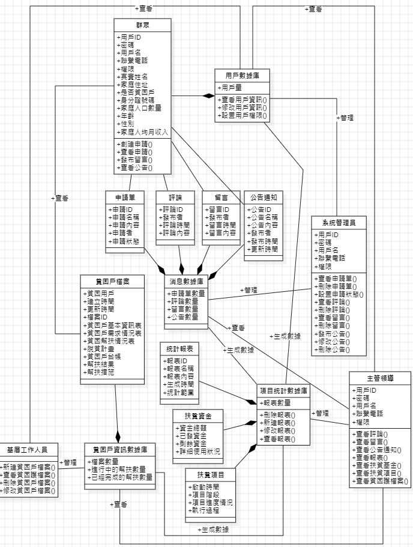
##### 2.4.2 精準扶貧管理系統關鍵類圖說明
###### 消息數據庫類
###### 由申請單、評論、留言、公告通知組成，包含了公告通知模塊、留言反饋模塊和消息管理模塊。請申請單內容、評論內容、留言內容由群眾用戶產生，由系統管理員負責管理處理，包含了查看、刪除、修改等操作。通知公告內容由系統管理員產生，群眾用戶可查看。主管領導可查看消息數據庫類中的所有內容。

###### 貧困戶信息數據庫類
###### 由所有審核認證的貧困戶檔案組成，對應了功能模塊為檔案管理。內容由基層工作人員錄入，並進行管理，包括新建、查看、修改、刪除等操作。群眾用戶可查看自己的貧困戶檔案，主管領導可查看所有的貧困戶檔案。

###### 用戶數據庫
###### 由所有群眾用戶的基本信息組成，對應的功能模塊為用戶管理。內容由註冊群眾用戶產生，系統管理員可對內容進行管理，包括查看、修改用戶信息以及設置用戶權限。基礎工作人員和領導可查看用戶數據庫內容的用戶基本信息。

###### 項目統計數據庫類
###### 由扶貧項目、扶貧資金以及統計報表組成，對應的功能模塊為審查監管。內容有用戶數據庫、貧困戶信息數據庫和消息數據庫的數據統計生成。由主管領導負責管理，包括新建、查看、修改、刪除報表和查看項目及項目資金等等操作。
#### 2.5 開發視圖建模
##### 2.5.1 包圖設計建模
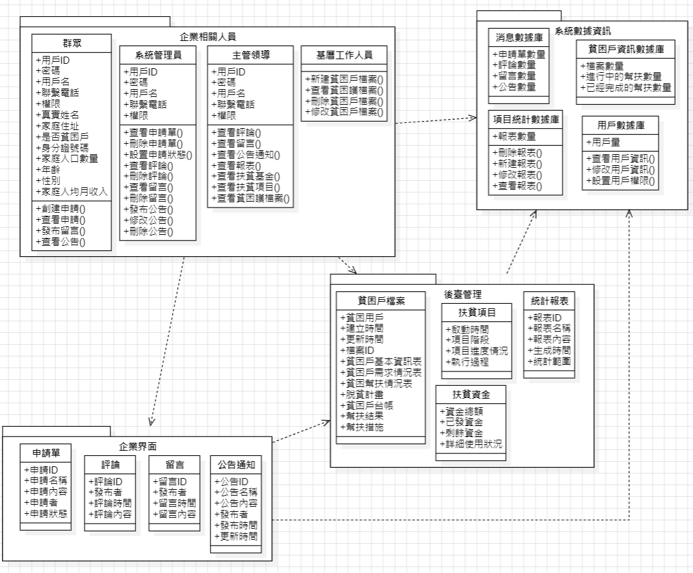
###### 【說明】
######   1.精準扶貧管理系統包圖主要由“業務相關人員”、“業務界面”、“後台管理”以及“系統數據信息”是四包組成。
######   2.業務相關人員包包括群眾用戶類、系統管理員類、主管領導類以及基層管理人員類。群眾依賴業務界面，基層工作人員和系統管理員依賴後台管理。所有的數據內容都依賴於系統數據庫。
######   3.業務界面包包括申請單類、評論類、留言類以及公告通知類。主要為群眾用戶涉及處理的一系列界面操作內容，依賴於後台管理。
######   4.後台管理包包括了貧困戶檔案類、扶貧項目類、扶貧資金類以及統計報表類。主要為基層工作人員以及主管領導需要處理和查看的一系列內容，依賴於系統數據信息。
###### 系統數據信息包包括消息數據庫內、貧困戶信息數據庫類、用戶數據庫類以及項目統計數據庫類，其他包提供數據內容支持。
##### 2.5.2 組件圖設計建模
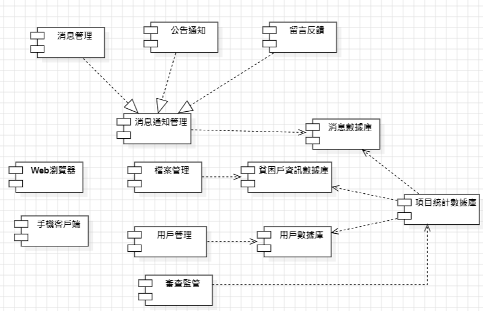
###### 【說明】
######   1.精準扶貧管理系統組件圖主要包括圖2.5.2-1所示的13個組件。
######   2.消息通知管理組件由消息管理、公告通知以及留言反饋組件組成。
######   3.消息通知管理組件依賴與消息數據庫組件；檔案管理組件依賴於貧困戶信息數據庫組件；用戶管理組件依賴於用戶數據庫組件；審查監管組件依賴於項目統計數據庫組件。
######   4.項目統計數據庫的數據內容由消息數據庫、貧困戶信息數據庫以及用戶數據庫生成，所以項目統計數據依賴於三者。
#### 2.6 過程視圖之交互圖建模
###### 針對精準扶貧管理系統的部分關鍵用例作如下順序圖建模。
##### 2.6.1 註冊用戶順序圖
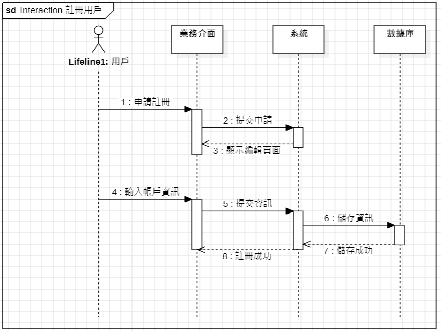
##### 2.6.2提交申請順序圖
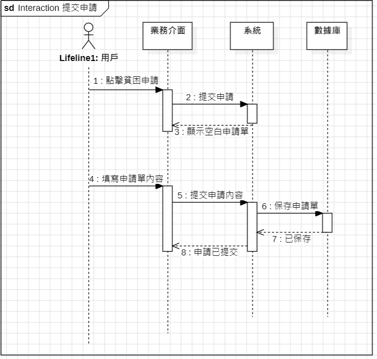
##### 2.6.3查看貧困戶檔案順序圖
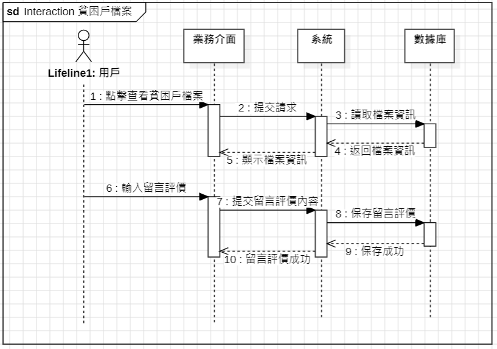
##### 2.6.4查詢公告順序圖
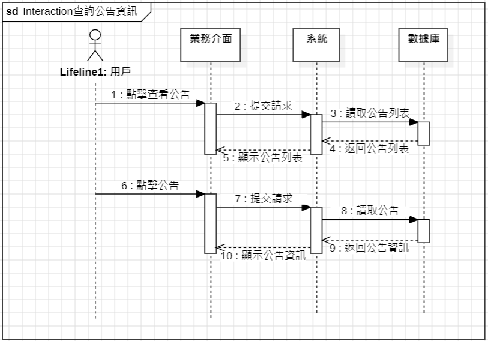
##### 2.6.5 查詢系統數據信息順序圖
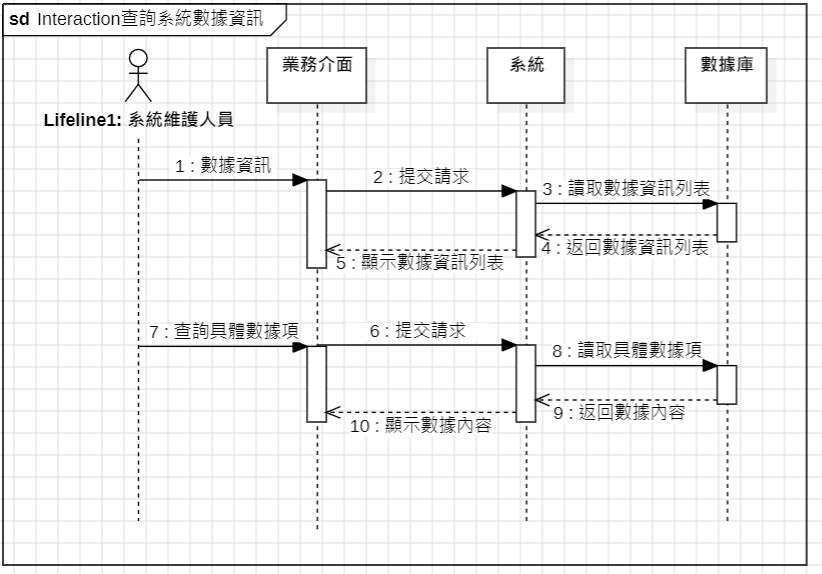
#### 2.7物理視圖之部署圖建模
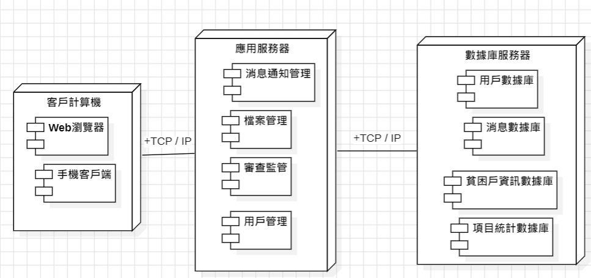
###### 【說明】
######   1.精準扶貧管理系統部署圖主要由客戶計算機、應用服務器以及數據庫服務器三個部分組成。
######   2.客戶計算機主要包括方便攜帶查看的手機客戶端和方便操作處理的web瀏覽器端。
######   3.消息通知管理、檔案管理、審查監管、用戶管理等一些列系統管理組件都部署在應用服務器上，以供系統管理員、基層工作人員以及主管領導操作管理。
######   4.用戶數據庫、消息數據庫、貧困戶信息數據庫以及項目統計數據庫都部署在數據庫服務器上，為其他節點提供數據內容支持。
### 3 利用設計模式改進
#### 3.1 消息通知模塊管理模塊的原設計方案類圖
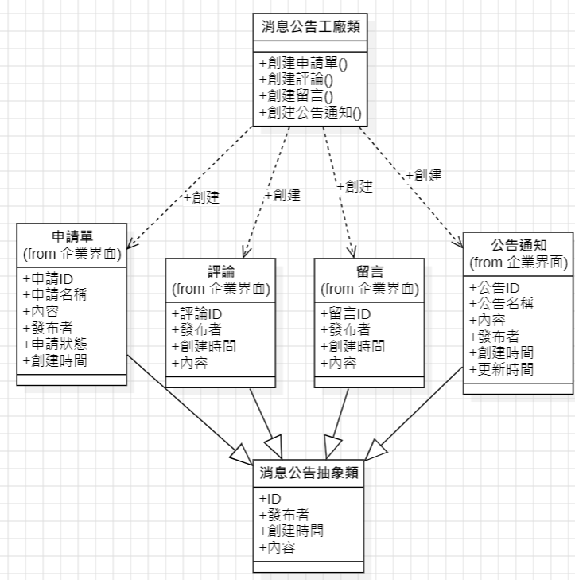
###### 【說明】
######   1.精準扶貧管理系統的消息通知模塊主要包括用戶申請、用戶評論、用戶留言以及公告通知的管理。
######   2.由於申請單、評論、留言和公告通知有共同的屬性，所以我們抽象出一個消息公告的抽象類，做為四者的父類，以供繼承。
######   3.消息公告剛才類負責申請單、評論、留言以及公告通知的對象創建。
#### 3.2消息通知模塊管理模塊采用工廠方法模型設計方案類圖
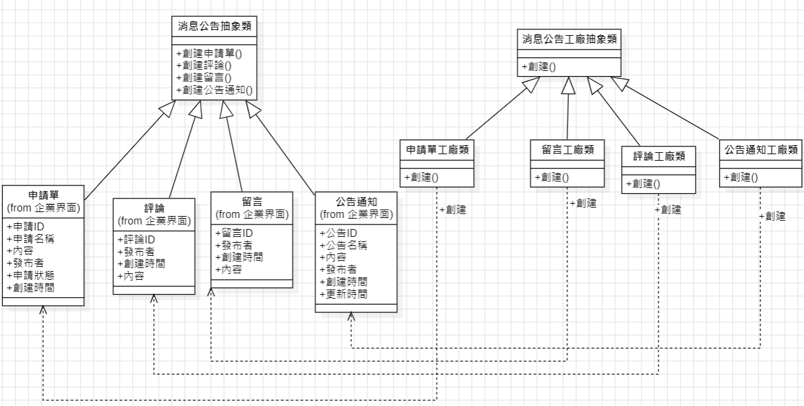
###### 【說明】
######   1.精準扶貧管理系統的消息通知模塊主要包括用戶申請、用戶評論、用戶留言以及公告通知的管理。
######   2.申請單、評論、留言以及公告通知繼承於消息公告抽象類。
######   3.分別創建留言工廠類、申請單工廠類、評論工廠類以及公告通知工廠類以實現對留言、申請單、評論以及公告通知的創建。
######   4.創建消息公告工廠抽象類，以供留言工廠類、申請單工廠類、評論工廠類以及公告通知工廠類繼承。
#### 3.3設計模式改進前後對比分析
###### 在上例中可以看到，原模式最大的缺點是當有新產品要加入到系統中時，必須修改工廠類，加入必要的處理邏輯，這違背了“開閉原則”。在該模式中，所有的產品都是由同一個工廠創建，工廠類職責較重，業務邏輯較為覆雜，具體產品與工廠類之間的耦合度高，嚴重影響了系統的靈活性和擴展性，而工廠方法模式則可以很好地解決這一問題。

###### 工廠方法模式又稱為工廠模式，它屬於類創建型模式。在工廠方法模式中，工廠父類負責定義創建產品對象的公共接口，而工廠子類則負責生成具體的產品對象，這樣做的目的是將產品類的實例化操作延遲到工廠子類中完成，即通過工廠子類來確定究竟應該實例化哪一個具體產品類。

###### 在工廠方法模式中，抽象的的消息公告工廠類不再負責所有的消息公告的創建，而是將具體創建工作交給子類去做。這個抽象類僅僅負責給出具體工廠必須實現的接口，而不負責哪一個消息公告類被實例化這種細節，這使得工廠方法模式可以允許系統在不修改工廠角色的情況下引進新消息公告類型。
### 4 總結
#### 4.1內容總結
###### 本次課程設計利用“4+1”視圖建模方法進行“精準扶貧管理系統”的軟件架構設計。架構內容以及設計流程為精準扶貧管理系統內容描述、需求分析、場景視圖之用例圖設計建模、邏輯視圖之類圖設計建模、發開視圖設計建模、過程視圖之交互圖設計建模、物理視圖之部署圖設計建模。其中需求分析包括角色分析、系統需求分析以及系統公告了模塊圖三個部分；開發視圖設計建模包括包圖設計建模和組件圖設計建模。

###### 最有利用設計模式對設計進行改進。主要針對消息公告管理模塊來進行實現，利用工廠方法模式進行改進，並對兩種設計方法進行了對比分析。
#### 4.2工作總結
###### 本次課程設計的完成主要依賴於軟件架構課程所學的相關知識，再加上適當的相關參考文獻的閱讀，才得以將整個軟件架構課程設計很好的完成。整個課程設計的過程中，除了對“4+1”視圖建模方法的具體使用以及對設計模式的理解，還非常考驗對整個軟件從需求的提出到整個架構建模實現的流程思路，和處理邏輯。

###### 根據提供的精準扶貧管理系統內容文檔，結合自己的理解，提煉出系統需求並設計出大概的功能模塊。在此基礎上按照“4+1”視圖建模方法的流程執行下來。其間可能會存在些許缺失或冗余的情況，不過重要的是在設計的過程中，加深了我對課堂所學知識的理解，通過實際的練習，熟練的掌握了整個軟件架構設計的思路、流程以及方法，收獲豐碩。

###### 總的來說，這次課程設計加深我對軟件系統架構基礎理論和基本知識的理解，掌握軟件系統架構設計的基本方法，達到進一步綜合運用所學知識和增強實際動手能力的目的。
### 參考資料
[利用“4+1”視圖建模方法進行“精準扶貧管理系統”的軟件架構設計](https://www.cnblogs.com/joselynzhao/p/12850496.html)
